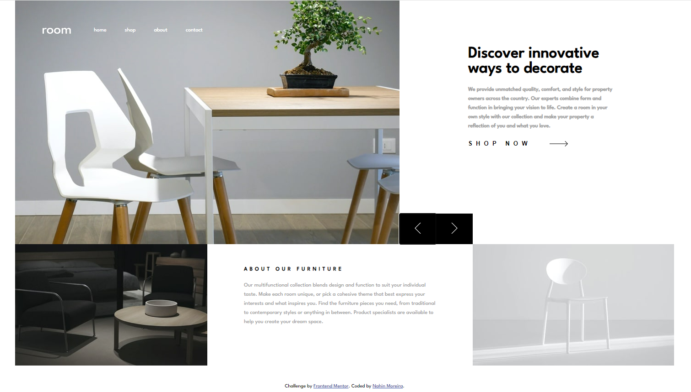

# Frontend Mentor - Solução de página inicial da sala

Esta é uma solução para o [desafio da página inicial do Room no Frontend Mentor](https://www.frontendmentor.io/challenges/room-homepage-BtdBY_ENq). Os desafios do Frontend Mentor ajudam você a melhorar suas habilidades de codificação através da construção de projetos realistas.

## Índice

- [Visão geral](#visão-geral)
  - [O desafio](#o-desafio)
  - [Captura de tela](#captura-de-tela)
  - [Links](#links)
- [Meu processo](#meu-processo)
  - [Construído com](#construído-com)
  - [O que aprendi](#o-que-aprendi)
  - [Desenvolvimento contínuo](#desenvolvimento-contínuo)
  - [Recursos úteis](#useful-resources)
- [Autor](#autor)
- [Agradecimentos](#agradecimentos)

## Visão geral

### O desafio

O desafio consiste em criar uma página inicial responsiva para um site de decoração de interiores, onde os usuários podem ver o layout ideal do site dependendo do tamanho da tela do dispositivo, interagir com os elementos e navegar pelo controle deslizante.

### Captura de tela

###Links

- URL da solução: [Adicione o URL da solução aqui](https://your-solution-url.com)
- URL do site ativo: [Adicione o URL do site ativo aqui](https://your-live-site-url.com)

## Meu processo

### Construído com

-HTML5 semântico
-CSS personalizado
-Flexbox Layout
-Abordagem mobile-first
-JavaScript para funcionalidades interativas

### Desenvolvimento contínuo

Para continuar a melhorar minhas habilidades, pretendo me aprofundar mais em técnicas avançadas de CSS, como animações e transições, e também explorar frameworks front-end como React.js para criar interfaces mais dinâmicas.

### Recursos úteis

- [CSS Tricks](https://css-tricks.com/) - Um excelente recurso para aprender mais sobre CSS e suas melhores práticas.
- [MDN Web Docs](https://developer.mozilla.org/pt-BR/) - Uma referência completa para HTML, CSS e JavaScript.
- [Frontend Mentor](https://www.frontendmentor.io/challenges) - Ótimos desafios para praticar e aprimorar habilidades de codificação.

## Autor

- Mentor de Frontend - [@nahinMSM](https://www.frontendmentor.io/profile/nahinMSM)
- Linkedin - [Nahin Moreira](https://www.linkedin.com/in/nahin-moreira-752b9a246/)

## Agradecimentos

Gostaria de agradecer à comunidade do Frontend Mentor por fornecer desafios incríveis que ajudam a impulsionar minhas habilidades de desenvolvimento web. Também agradeço a todos os recursos online que me ajudaram a aprender e resolver problemas durante este projeto.